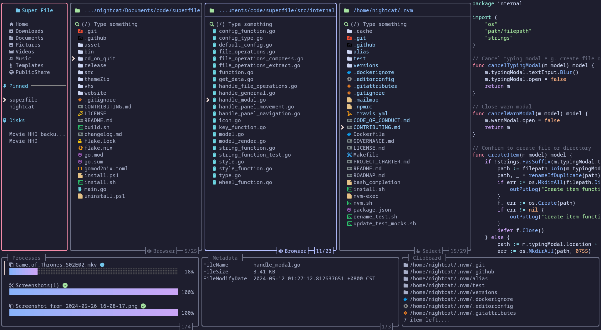

<div align="center">

<h4>wyrm is supported by the community.</h4>

<a href="https://ko-fi.com/yorukot">
  
</a>

<hr>

</div>

<div align="center">
<br>
<picture>
  <source width="300" media="(prefers-color-scheme: dark)" srcset="website/src/assets/wyrm-night.svg" />
  <source width="300" media="(prefers-color-scheme: light)" srcset="website/src/assets/wyrm-day.svg" />
  
</picture>
<br><br>

[](https://raw.githubusercontent.com/Noswad123/wyrm/refs/heads/main/LICENSE) [](https://discord.gg/YYtJ23Du7B) [](https://github.com/Noswad123/wyrm/releases/latest)   [](https://www.coderabbit.ai/)



</div>

## Demo

| Perform common operations  |
| -------------------------- |
|  |

## Content

- [Demo](#demo)
- [Content](#content)
- [Installation](#installation)
  - [macOS and Linux](#macos-and-linux)
  - [Windows](#windows)
    - [Powershell](#powershell)
    - [Winget](#winget)
    - [Scoop](#scoop)
  - [More installation methods](#more-installation-methods)
- [Build](#build)
  - [For macOS/Linux](#for-macoslinux)
  - [For Windows](#for-windows)
- [Start wyrm](#start-wyrm)
- [Supported Systems](#supported-systems)
- [Tutorial](#tutorial)
- [Plugins](#plugins)
- [Themes](#themes)
- [Hotkeys](#hotkeys)
- [Notes](#notes)
- [Troubleshooting](#troubleshooting)
- [Uninstalling](#uninstalling)
  - [macOS and Linux](#macos-and-linux-1)
  - [Windows](#windows)
- [Contributing](#contributing)
- [Thanks](#thanks)
  - [Support](#support)
  - [Core maintainer](#core-maintainer)
  - [Contributors](#contributors)
  - [Powered by](#powered-by)
  - [Star History](#star-history)
- [༼ つ ◕\_◕ ༽つ Please share.](#-つ-_-つ-please-share)

## Installation

### macOS and Linux

```bash
bash -c "$(curl -sLo- https://wyrm.dev/install.sh)"
```

If you want to inspect the script, see : [install.sh](./website/public/install.sh)

### Windows

#### Powershell

```powershell
powershell -ExecutionPolicy Bypass -Command "Invoke-Expression ((New-Object System.Net.WebClient).DownloadString('https://wyrm.dev/install.ps1'))"
```

If you want to inspect the script, see : [install.ps1](./website/public/install.ps1)

#### [Winget](https://winget.run/)

```powershell
winget install --id Noswad123.wyrm
```

#### [Scoop](https://scoop.sh/)

```
scoop install wyrm
```

### More installation methods

[Click me to check on how to install](https://wyrm.dev/getting-started/installation/)

## Build

You can build the source code yourself by using these steps:

**Requirements**

- [golang](https://go.dev/doc/install)

**Build Steps**

Clone this repository using the following command:

```
git clone https://github.com/Noswad123/wyrm.git --depth=1
```

Enter the downloaded directory:

```bash
cd wyrm
```

### For macOS/Linux

Run the `build.sh` file:

```bash
./build.sh
```

Add the binary file to your $PATH, e.g., in `/usr/local/bin`:

```bash
sudo mv ./bin/wyrm /usr/local/bin
```

### For Windows

```bash
go build -o bin/wyrm.exe
```

Edit System Environment Variables and add wyrm repo's `bin` directory to your PATH

## Start wyrm

```bash
wyrm
```

## Supported Systems

- \[x\] Linux
- \[x\] macOS
- \[x\] Windows (Not fully supported yet)

## Tutorial

After you install wyrm, you can go [here](https://wyrm.dev/getting-started/tutorial/) to briefly understand how to use wyrm!

## Plugins

[Click me to the plugins wiki](https://wyrm.dev/list/plugin-list/)

## Themes

[Click me to the theme wiki](https://wyrm.dev/configure/custom-theme/)

## Hotkeys

> [!WARNING] If you are vim/nvim user please change your default hotkeys config to vim version!

[**Click me to see the hotkey wiki**](https://wyrm.dev/configure/custom-hotkeys/)

## Notes

We have an auto update functionality, that fetches wyrm's latest released version from github (if last timestamp of last version check was less than 24 hours) and prints a prompt to user, if there is a newer version available.

You can turn this off, by setting `auto_check_update` to false in wyrm config. [**Click me to see the config wiki**](https://wyrm.dev/configure/wyrm-config/)

## Troubleshooting

[**Click me to see common problem fix**](https://wyrm.dev/troubleshooting/)

## Uninstalling

### macOS and Linux

```bash
bash -c "$(curl -sLo- https://wyrm.dev/uninstall.sh)"
```

If you want to inspect the script, see : [uninstall.sh](./website/public/uninstall.sh)

### Windows

To uninstall wyrm on Windows, use this powershell script.

```powershell
powershell -ExecutionPolicy Bypass -Command "Invoke-Expression ((New-Object System.Net.WebClient).DownloadString('https://wyrm.dev/uninstall.ps1'))"
```

## Contributing

If you want to contribute please follow the [contribution guide](./CONTRIBUTING.md)

[**Click me to see changelog**](https://wyrm.dev/changelog)

## Thanks

### Support

- a Star on my GitHub repository would be nice 🌟
- You can buy a coffee for me 💖

[](https://ko-fi.com/G2G1JEGGC)

### Core maintainer

> We welcome anyone who wants to become a core maintainer. Feel free to reach out!

- **[@yorukot](https://github.com/yorukot)** - Original author and maintainer
- **[@lazysegtree](https://github.com/lazysegtree)** - Core maintainer

### Contributors

**Thanks to all the contributors for making this project even greater!**

<a href="https://github.com/Noswad123/wyrm/graphs/contributors">
  
</a>

### Powered by

<a href="https://jb.gg/OpenSource"></a>

Thanks to JetBrains team for providing open-source licenses to support the maintenance of wyrm.

### Star History

**THANKS FOR All OF YOUR STARS!** Your stars are my motivation to keep updating!

<a href="https://www.star-history.com/?repos=Noswad123%2Fwyrm&type=date&legend=top-left">
 <picture>
   <source media="(prefers-color-scheme: dark)" srcset="https://api.star-history.com/chart?repos=Noswad123/wyrm&type=date&theme=dark&legend=top-left&sealed_token=nEoMOYsfp1zwZ7rT-Fm6VR2yTa6cwW35VR0BwVxTuE8Dt17vRcRIQUFXeWdh6lZixlAl5e_fIVFs2Xe4cRdvAnexR5Q6JqlGVZK05Iu0mko8gYLjTdjq0g" />
   <source media="(prefers-color-scheme: light)" srcset="https://api.star-history.com/chart?repos=Noswad123/wyrm&type=date&legend=top-left&sealed_token=nEoMOYsfp1zwZ7rT-Fm6VR2yTa6cwW35VR0BwVxTuE8Dt17vRcRIQUFXeWdh6lZixlAl5e_fIVFs2Xe4cRdvAnexR5Q6JqlGVZK05Iu0mko8gYLjTdjq0g" />
   
 </picture>
</a>

<div align="center">

## ༼ つ ◕_◕ ༽つ Please share.

</div>
